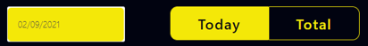
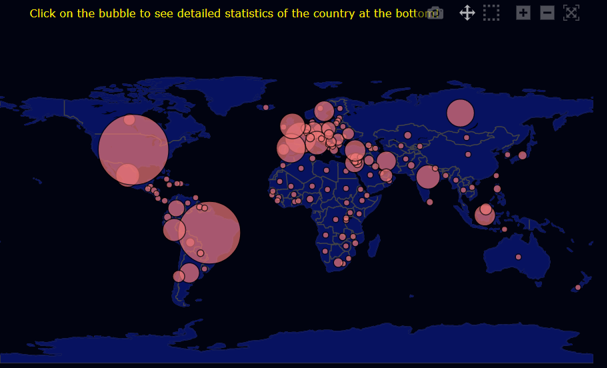
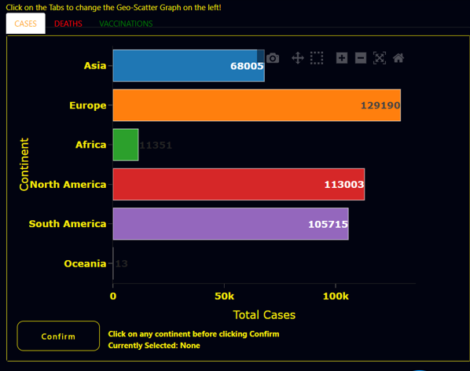
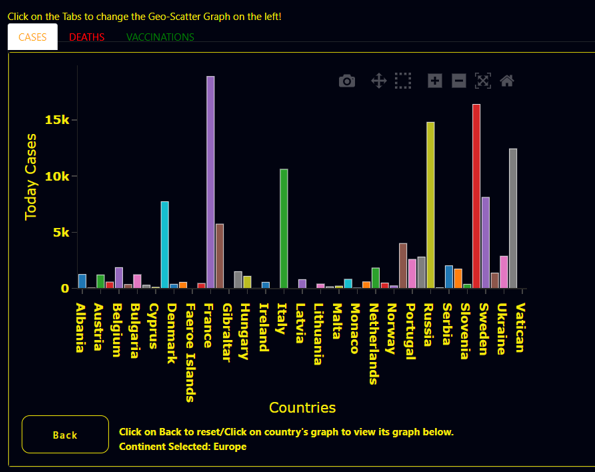
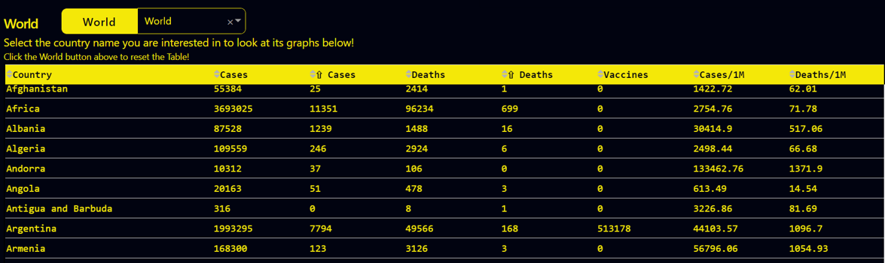
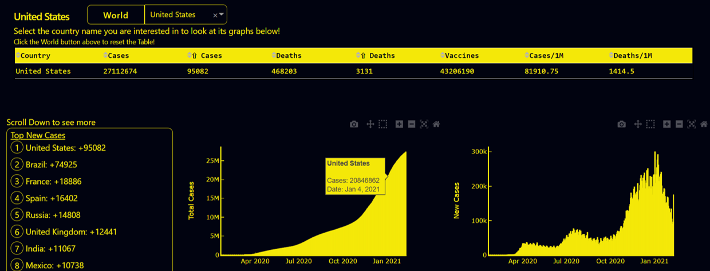
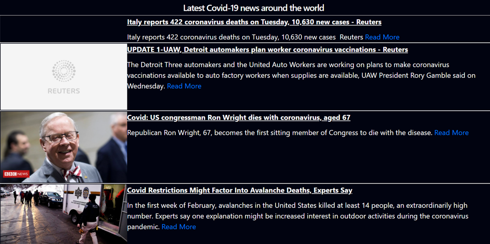

# Covid-19 Dashobard

###### Go to [analyse-covid](https://analyse-covid.herokuapp.com/) to view the web.

## Introduction:
This website is made using Dash, which shows the number of covid-19 cases, deaths and vaccinations around the world. 

There is a calendar at the top of the web, where users can select the date they are interested. Beside the calendar, there is a toggle to choose whether users want to display the total/daily stats. By default, the daily stats is selected. To select the total stats, click on 'Total'. Note that the GeoScatter and bar graphs below will change depending on the type of stats chosen.

The GeoScatter graph on the left (a world map with many bubbles), represents the daily number of cases of each country.

The bar graph on the right shows the number of daily increase in number of cases in each continent. Above the bar graph, there are 3 different buttons - Cases, Deaths, Vaccines for users to toggle. Click on any to display the chosen stat on the GeoScatter and bar graph.

You can drill down(select to zoom in to country level) the bar graph to display countries in the selected continent. Click 'Confirm' after selecting the continent. You can select any country you are interested in to view the country's stats at the bottom (table and 4 different line charts). Click the 'Back' button to drill back to continent level.

Selecting the 'World' button shows all countries' stats in the table and display World data for the 4 graphs at the bottom.

The dropdown beside it has all the country names in the world. Select any country from the dropdown to look at the country's stats and graphs at the bottom. On the left of the 4 graphs, there is a scrollable section that shows the top stats such as Top New Cases/Top Total Cases country in the world. 

Lastly, the section at the bottom of the 4 graphs shows the latest Covid-19 news around the world to keep you updated on the latest developments. 

## License:

This project is under the [MIT](https://github.com/spartan737/Covid-Dashboard-with-Dash/blob/master/LICENSE) license.

